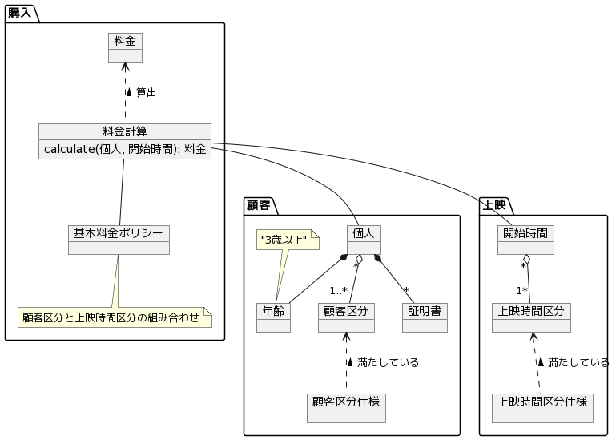
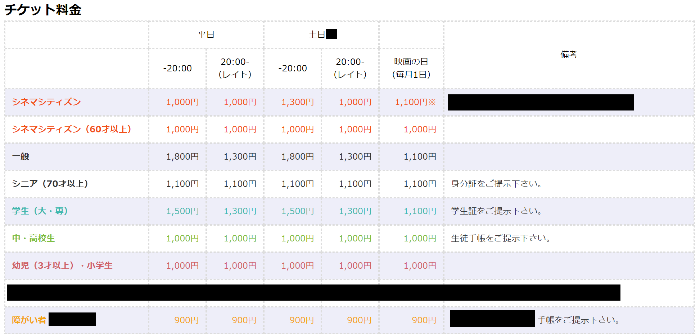

# 映画料金ドメインモデル

映画のチケット料金を算出するドメインモデリング。

お題：https://twitter.com/j5ik2o/status/1150589065432952832

## クラス図

## 料金表

### 考慮しない要素

最初はシンプルにするため、複雑な要素は省く。

- 祝日
- ※平日なら「映画の日」に関係なく1,000円！
- 障がい者（学生以上）、障がい者（高校以下）を障がい者に統合する
- 障がい者の同伴者
- 一部の区分（夫婦50割引、エムアイカード）
- 特別興行
- 3D作品
- 極上爆音上映
- パーク80
- 各種証明書の検証（有効な証明書が提出されるものとする）
